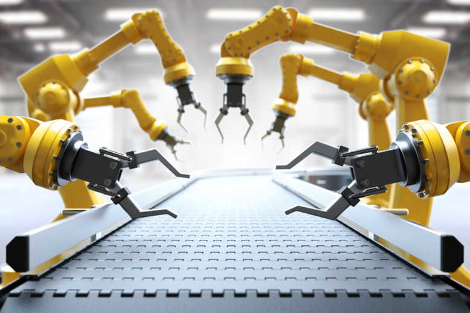

You don't want humans to go build themselves your apps by hand. Because humans are lazy. And because humans make mistakes.

You want any change to be released as soon as it passes all the stages of the CI pipeline. You want your test server and your production server to be in a state that is a pure function of :

- The git branch they're coupled with
- The result of the last pipeline execution
