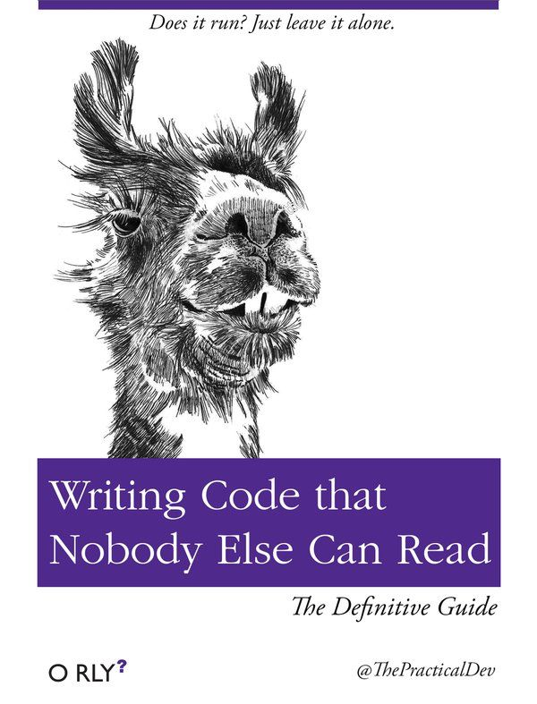

Code for humans, not for machines.

Code correctness > code readability > code performance.

There is no reason you can't have code that is correct, clear, and fast.

You'll be lucky to get there if you start by focusing on the 'fast' though.

