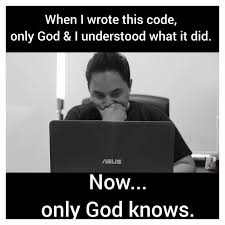

Let's agree on this : well-written code should not require any comments to describe what the objective of a variable or function is.

But in the reality, code comments are a necessary evil.

When writing comments, never explain the what or the how, explain the why and eliminate the potential ambiguities.

Find out what's interesting for the future reader. There is a high chance that it's gonna be you.



[But in the reality, code comments are a necessary evil](https://hackaday.com/2019/03/05/good-code-documents-itself-and-other-hilarious-jokes-you-shouldnt-tell-yourself/)

```js
/** BAD **/
// Returns the temperature
const getTemperature = () => this.temperature

/** GOOD **/
// This is for testing purpose only and shouldn't be called in the real world.
// If you need the temperature, use the Weather class instead.
const getTemperature = () => this.temperature
```
