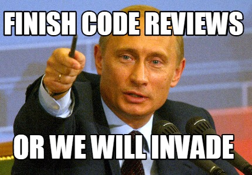

When the team is not used to do code reviews, it might be a little awkward to start code reviewing everything. Because if there is no feedback culture amongst the developers, code reviews can make people quite insecure, defensive, judgemental...

I think the keys to avoid this is to review the actual code and not the performance/competence of the developer. As a reviewer, your mission is to give a set of fresh eyes and to help, by pointing your finger at unhandled edge cases and typos. As a reviewee, your mission is to provide all the context of your PR so that the reviewer can do their job.

What's under review here is the team's ability to produce high quality software. It's not an ego battle.

Reviewing someone's code carefully before merging it is a very healthy way to catch bugs, and to make the codebase more readable. I actually never had a code review where no value was added to the project. Be it a bug fix, a comment, some documentation, manual tests...

There is always something to improve before a merge. And even if the code is perfect, it will now be known by the reviewer (it's always good to have perspective on other people's work), and maybe he will learn something during the process.
