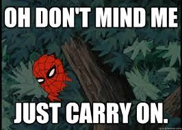

Even if a piece of code is commented, it's still in the middle of actual code. This is unnecessary noise for the reader.

If I tell you NOT to think about an elephant, you have to first build the mental representation of an elephant 🐘, before trying to not think about it ⛔️🐘.

This is exactly the same thing happening when you have to go through commented code. But way more frustrating.

Don't worry about loosing your code. Version control systems exist since the 70s. Have you heard about git ?
