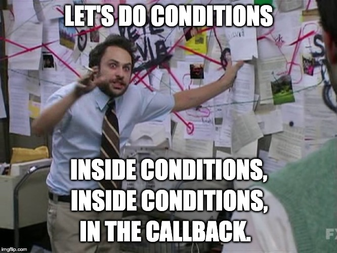
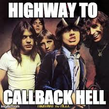

It’s very easy to get unweildy levels of indentation in JavaScript. So if we don’t strive to control it, the codebase overall quality takes serious hits.



The key takeaway here is that you should keep the “meat” of the code at the lowest indentation level possible.

There are many reasons for this : readability, testability, simplicity and single responsability principle.

When a codebase is having crazy indentation levels, it usually comes down to two things : asynchronous code and conditional statements.

Let's see how to fix them.

## Tame your async code



The syntactic sugar introduced with async/await improves a lot the readability of the code. Below is the same asynchronous code written with three different strategies.

First, the callback version.

Eww. This is gross.

In case you don't already know, this is nothing less than the famous [callback hell](http://callbackhell.com/).

```js
import { handle } from "./handle.js"
import { doSomething, doSomethingElse, sendBack } from "./feature.js"

// Ewww 🤢
User.find({ id: 42 }, function(err, user) {
  if (err) {
    return void handle(err)
  }

  doSomething(user, function(err, result) {
    if (err) {
      return void handle(err)
    }

    doSomethingElse(result, function(err, foo) {
      if (err) {
        return void handle(err)
      }

      sendBack(foo, function(err) {
        if (err) {
          return void handle(err)
        }
      })
    })
  })
})
```

There is a slightly better option : promises. To use them, the functions should be modified so that they return a value or a promise instead of relying on a callback. By doing so, we definitely improved the flatness of the code. But somehow, everything is now glued together, and it's still a little bit gross to have this big promises chain.

```js
import { handle } from "./handle.js"
import { doSomething, doSomethingElse, sendBack } from "./feature.js"

// Mehh 🤒
User.find({ id: 42 })
  .then(user => doSomething(user))
  .then(result => doSomethingElse(result))
  .then(foo => sendBack(foo))
  .catch(err => handle(err))
```

The most elegant solution is to use `async/await`. It requires a little bit of boilerplate code and a good understanding of promises. But it allows a much more flexible async code. Once you get used to the caveats (the error handling techniques mainly), it'll keep the codebase readability under control without slowing down the productivity.

```js
import { handle } from "./handle.js"
import { doSomething, doSomethingElse, sendBack } from "./feature.js"

// Yay 😎
async function main() {
  try {
    const user = await User.find({ id: 42 })
    const result = await doSomething(user)
    const foo = await doSomethingElse(foo)
    await sendBack(foo)
  } catch (err) {
    handle(err)
  }
}
main()
```

You can even avoid the try/catch blocks by delegeting the error handling to the caller function.

```js
import { handle } from "./handle.js"
import { doSomething, doSomethingElse, sendBack } from "./feature.js"

async function main() {
  const user = await User.find({ id: 42 })
  const result = await doSomething(user)
  const foo = await doSomethingElse(foo)
  await sendBack(foo)
}
main().catch(err => handle(err))
```

## Avoid else, return early

On this subject, I would really recommend ready [this blog post](https://blog.timoxley.com/post/47041269194/avoid-else-return-early) written by Tim Kevin Oxley.


Return means never having to say else. Not only does this unindents a bunch of code, it also moves the method’s main purpose/intention/meat to indentation level 0. This litterally moves away the noise of error handling. Which improves readability.

```js
// This is unnecessary complicated 💩
howBig(num) {
  let _return

  if (typeof num === "number") {
    if (num <= 10) {
      _return = "small"
    } else if (num > 10 && num <= 100) {
      _return = "medium"
    } else {
      _return = "big"
    }
  } else {
    _return = "dont know"
  }

  return _return
}
```

```js
// Less room for logical errors and way more readable 🦄
howBig(num) {
  if (typeof num !== "number") {
    return "don't know"
  }

  if (num <=10) {
    return "small";
  }

  if (num <= 100) {
    return "medium"
  }

  return "big";
}
```

## Conclusion

First, move your async code to async/await. If you're using some legacy NodeJS APIs which still use callback functions, promisify them with [util.promisify](https://nodejs.org/dist/latest-v8.x/docs/api/util.html#util_util_promisify_original).

Second, a good rule of thumb is to never write `else` or `else if` statement. It will bring better readability and testability to your code, and it will force you to think about the edge cases before rushing into implementation (I wrote a whole post about this, you can read it [here](/code-without-error-handling-is-not-code)). Of course, don't be dogmatic about this, sometimes rules are meant to be broken.
