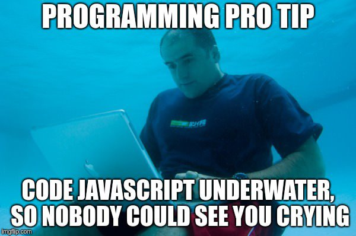

Besides being a passionate software engineer, I am also an aviation enthusiast. As a matter of fact, after high school I really hesitated between software engineering and aerospatial engineering.

As it turned out, I was way more talented in the former discipline so I ended up in a computer sciences curriculum.

Still, I often find myself consuming big chunks of the aviation content on the Internet. I'm quite fascinated by the whole airline industry, in its technical aspects.

Interestingly, it appears that in order to fly an aircraft safely, there are so many rules that are applicable to software engineering. There is a fascinating [Hacker News thread](https://news.ycombinator.com/item?id=12093402) about it, with lots of different perspectives.

One of these rules that I want to highlight today, is the fact that pilots have a checklist for everything : _preflight, pushback, engine start, after engine start, taxi, before takeoff, after takeoff, climb, descent, approach, before landing, after landing, shutdown._

In other words, even if there are two smart and skilled pilots in the cockpit, the flight operations are driven by a set of pre-written rules. Pilots systematically go through the checklists. Each. Damn. Flight. This is a hard requirement to guarantee the safety.

On the other hand, these days I'm working for a very small dev team that doesn't have any explicit way to control the software quality. In appearance, it looks OK, because there aren't many users of the product, and the velocity isn't very high, so bug reports are quite rare. But still. Code is shipped to production as is. And the more time flies, the more I get frustrated and anxious about this. It feels so wrong to me.

I envy the serenity that checklists must bring.

So I wrote down a list of patterns that I find crucial to ensure decent software quality standards, hoping to make the team adopt them gradually.

## Dogmatism and cognitive rigidity aren't welcome

---

## Will it make the boat go faster ?

---

## Don't import your 5 megabytes image in the project, thinking you'll optimize it later. Spoiler alert: you won't. Optimize it straight away.

---

## If you're using express, give your middlewares function a name.

They'll be easier to trace and monitor than anonymous functions.

---

## The filesystem is not a database.

