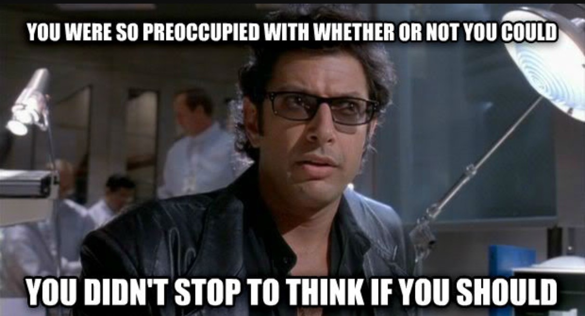

Don't add and don't mutate anything in the global scope. It's common knowledge. If you want to know why, I'd suggest you to read the [wiki.c2 article on it](http://wiki.c2.com/?GlobalVariablesAreBad "Global Variables Are Bad") and this [StackExchange thread](https://softwareengineering.stackexchange.com/questions/148108/why-is-global-state-so-evil/148154#148154 "Why is Global State so Evil?").

If your codebase is already filled with user-defined globals, you can :

1. Manipulate them more explicitely :`global.foo` in Node or `self.foo` in the browser. The behavior doesn't change but now the code smell is more explicit.
2. Remove them.
