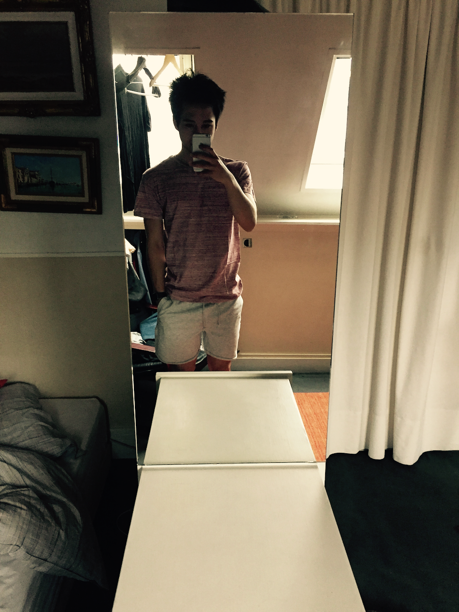

I was very lucky to grow up in a family where nobody was having any serious health concerns. It has never been a subject that we used to talk about. Also, my parents had me late in their life, and I did not have the opportunity to met my grandparents.

So beside Godzilla - my tiny hamster who passed away when I was eleven (#RIP) - I have never been really confronted to severe illness situations or death.

During adolescence, this ground was very fertile to develop an invincible, risk-taking, careless mindset about my own health. It simply didn't occured to me that I was vulnerable. And in some ways, I wasn't ! The health capital of young folks is ridiculous. Man, if I did today half the shit I did at this age, I'd probably call 911.

This post is kind of a letter to my younger self, providing some sane advice to keep your health in the best shape possible. Secretly, I hope that a few readers will have a "Ha! This!" moment, and try to change small things in their own life. If so, please let me know.

## Hi, stupid !

I know that when you’re young, you feel invincible. But DUH, you’re not. You’re clearly not. Sorry to break the mood, but during youth, you only have time on your side.

Actually, it doesn't take a PhD to understand this : your body is a biological system that responds to your lifestyle. Of course, it suffers from any aggression or deprivation.

Ask your elders if they don’t regret starting their crappy habits. Ask them about their weight, their medical conditions, the pills they take to sleep at night, to enjoy a meal, to endure stress, to have sex or whatever.

Taking care of yourself should be your number 1 priority, period. Because this is your concrete life : health is your energy levels, your shape, your mood, your potential, your limits... It will definitely influence your intimate relationships, your carreer and your personality.

The beauty of being young is that you can be anything you want. But when your health starts to deteriorate, invisible doors start to close, without you really noticing them :

- You can't have fun doing sport anymore because you can't run. You breathe poorly. You don't have what it takes.
- Your sleep-deprived brain don't serve you well during school exams. You fail to join prestigious universities. Adios dream carreers, airline pilot, athlete, teacher, engineer...
- Your alcohol and drugs driven behavior will get you in trouble. Dumb mistakes at the best. Serious accidents and broken relationships at the worst.
- And any of the thousands of sad consequences that self-destructive behaviors provoke.

Just stop it, man. Being unhealthy won't get you anywhere but to disapointment in life. You may find it boring now, but you'll thank yourself later, while the cool kids go to rehab and therapy.

Unfortunately, the healthy path is not the simple path. It has a price. It requires time and discipline. Sometimes, it requires to let go friendships. And it's never really finished, because once you're in a pretty good state, you still have to maintain it !

Here are some guidelines to help you during the journey.

## Understand your mind

One of the worst legacies of my youth, is the insane tendency to be addicted to anything that make me feel good.

Back to when I was a little kid, I was addicted to sugar. I remember myself eating ton of it and hiding it from my parents.

Then, I discovered computers and video games. I used to lock myself in my bedroom and to sacrifice all my nights to the benefit of it.

Then came the era of the Internet : MSN messenger, unlimited texting and phone calls, social medias, tv shows, not to mention porn.

Then went cigarettes. Then weed. A few years later, I was used to drugs like cocain and MDMA.

Science tells us that all of these activities make our body produce hormones : **serotonin** and **dopamin**, to name a few.

They are responsible of the delightful feelings we have when eating something tasty, when we have an orgasm, when we’re high on drugs, when we gamble money, or when we get dozens of likes on our latest Instagram picture.

And there’s nothing wrong about enjoying oneself with short-term pleasure. It’s fun. It creates nice souvenirs. It can be shared with your beloved ones.

I think the biggest trap of these pleasure-producing activities arises from a very unclear and intimate concept : **balance**.

Addiction comes in when you look for this artificial happiness, when you look for something that make you feel good, as an automatic response to stressful situations :

- It’s the cigaret that you smoke when you want to focus on something.
- It’s when you’re checking social medias instead of socializing with people.
- It’s the alcohol that you need to drink during a date or before public speaking.
- It’s the weed that you smoke to run away from boredom.
- It’s when you binge a TV show or YouTube videos instead of doing what you’re expected to do.
- It’s when you play poker or WoW all night long instead of working on yourself, your family or your girlfriend/boyfriend.

These behaviors are toxic. Once started, we tend to cumulate them, which generates complex addictions, and eventually end up as suffering and depression. The worst is that, the younger you are, the more hardwired these reflexes tend to be.

It’s a shame that we don't teach mental hygiene to young people.
My concrete advice are:

- Surround yourself with mentally healthy people. Use your gut feeling to find them.
- Avoid toxic people. Unfortunately, there are many, and sometimes you can't really avoid them. No need to fight. Just do your thing and don't give any value to their judgements.
- Talk to a therapist, even though you think you don’t need to. Pick one issue in your life that bothers you, and let him/her help you fix it. So that you can learn the process of mental hygiene.
- Read Christophe André’s book Imparfaits, Libres et heureux
- Get your dopamine/serotonine dose through sport, novelties, work and interactions with other people. Forget about drugs and your following/follower ratio, it’s a vicious dead-end.
- Listen to Gary Vaynerchuck when he talks about self awareness and psychology.

Don’t fall into the trap of your own fears. Stressful situations happen to everyone, especially during youth. You’re not an exception. It’s part of the journey, for everyone. Shitloads of conflicts and mistakes are coming towards you, and it’s vital for you to handle them in a sane manner. Good things will happen too! There is no shortcut to have a meaningful life, you have to listen to yourself, make your moves, get knocked out sometimes, repeat and love the process.

## Understand your body

By “understand your body” I mean any knowledge that affects your own physical enveloppe : anatomy, nutrition, immune system, genetics, digestive system, cardiovascular system, body composition, chronic disease , to name a few… Don’t outsource the effort to know yourself. You don’t need to become a specialist but you can’t afford to ignore this horizontal knowledge. Your body is a complex machine that needs to be fueled, used and maintened right to express its potential. Nobody will do it for you. Public health campaigns are definitely not enough, if useful at all.

The best way to approach this, is to leverage your narcissism and your desire to seduce people. You want this solid 6pack, right ? How about getting it ?Understanding your body is as simple as pushing yourself towards an ambitous fitness goal. You will learn during your fitness journey how your body works and responds, how to feed it and how to keep it in shape. Basically, you will learn how to master it, in addition to get a very fit physique.

But make sure that you don’t fall in the trap of becoming a fitness addict ;)

Balance and adjust.
